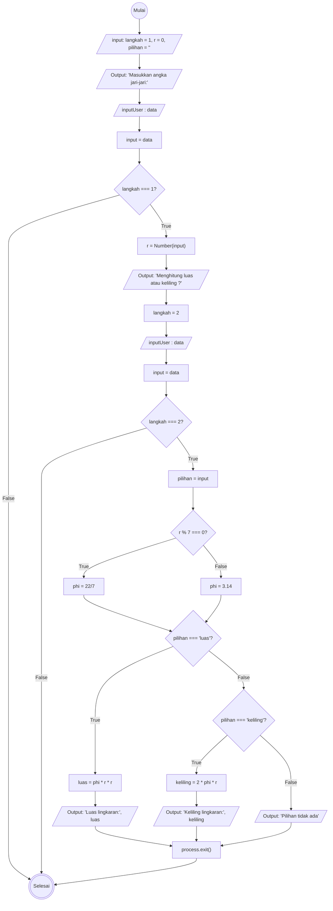

```mermaid
flowchart TD
  Start@{shape: circle, label: "Mulai"}
  Init@{shape: lean-r, label: "input: langkah = 1, r = 0, pilihan = ''"}
  Output1@{shape: lean-r, label: "Output: 'Masukkan angka jari-jari:'"}
  WaitInput1@{shape: lean-r, label: "inputUser : data"}
  letInput@{shape: rect, label: "input = data"}
  CekLangkah1@{shape: diamond, label: "langkah === 1?"}
  Proses1@{shape: rect, label: "r = Number(input)"}
  Output2@{shape: lean-r, label: "Output: 'Menghitung luas atau keliling ?'"}
  SetLangkah@{shape: rect, label: "langkah = 2"}
  WaitInput2@{shape: lean-r, label: "inputUser : data"}
  letInput2@{shape: rect, label: "input = data"}
  CekLangkah2@{shape: diamond, label: "langkah === 2?"}
  Proses2@{shape: rect, label: "pilihan = input"}
  CekMod@{shape: diamond, label: "r % 7 === 0?"}
  SetPhi1@{shape: rect, label: "phi = 22/7"}
  SetPhi2@{shape: rect, label: "phi = 3.14"}
  CekPilihan@{shape: diamond, label: "pilihan === 'luas'?"}
  HitungLuas@{shape: rect, label: "luas = phi * r * r"}
  OutputLuas@{shape: lean-r, label: "Output: 'Luas lingkaran:', luas"}
  CekKeliling@{shape: diamond, label: "pilihan === 'keliling'?"}
  HitungKeliling@{shape: rect, label: "keliling = 2 * phi * r"}
  OutputKeliling@{shape: lean-r, label: "Output: 'Keliling lingkaran:', keliling"}
  OutputError@{shape: lean-r, label: "Output: 'Pilihan tidak ada'"}
  Exit@{shape: rect, label: "process.exit()"}
  End@{shape: dbl-circ, label: "Selesai"}

  Start --> Init
  Init --> Output1
  Output1 --> WaitInput1
  WaitInput1 --> letInput
  letInput --> CekLangkah1
  CekLangkah1 --True--> Proses1
  CekLangkah1 --False--> End
  Proses1 --> Output2
  Output2 --> SetLangkah
  SetLangkah --> WaitInput2
  WaitInput2 --> letInput2
  letInput2 --> CekLangkah2
  CekLangkah2 --True--> Proses2
  CekLangkah2 --False--> End
  Proses2 --> CekMod
  CekMod --True--> SetPhi1
  CekMod --False--> SetPhi2
  SetPhi1 --> CekPilihan
  SetPhi2 --> CekPilihan
  CekPilihan --True--> HitungLuas
  HitungLuas --> OutputLuas
  OutputLuas --> Exit
  CekPilihan --False--> CekKeliling
  CekKeliling --True--> HitungKeliling
  HitungKeliling --> OutputKeliling
  OutputKeliling --> Exit
  CekKeliling --False--> OutputError
  OutputError --> Exit
  Exit --> End
```
