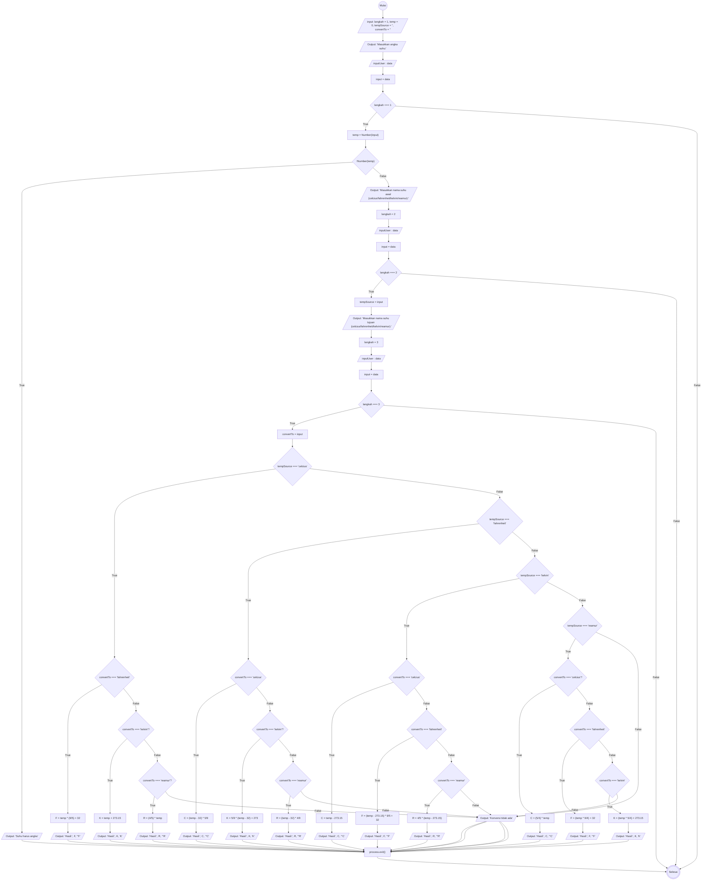

```mermaid
flowchart TD
  Start@{shape: circle, label: "Mulai"}
  Init@{shape: lean-r, label: "input: langkah = 1, temp = 0, tempSource = '', convertTo = ''"}
  Output1@{shape: lean-r, label: "Output: 'Masukkan angka suhu:'"}
  WaitInput1@{shape: lean-r, label: "inputUser : data"}
  LetInput1@{shape: rect, label: "input = data"}
  CekLangkah1@{shape: diamond, label: "langkah === 1"}
  Proses1@{shape: rect, label: "temp = Number(input)"}
  CekNumber@{shape: diamond, label: "!Number(temp)"}
  OutputError1@{shape: lean-r, label: "Output: 'Suhu harus angka'"}
  Output2@{shape: lean-r, label: "Output: 'Masukkan nama suhu awal (celcius/fahrenheit/kelvin/reamur):'"}
  SetLangkah2@{shape: rect, label: "langkah = 2"}
  WaitInput2@{shape: lean-r, label: "inputUser : data"}
  LetInput2@{shape: rect, label: "input = data"}
  CekLangkah2@{shape: diamond, label: "langkah === 2"}
  Proses2@{shape: rect, label: "tempSource = input"}
  Output3@{shape: lean-r, label: "Output: 'Masukkan nama suhu tujuan (celcius/fahrenheit/kelvin/reamur):'"}
  SetLangkah3@{shape: rect, label: "langkah = 3"}
  WaitInput3@{shape: lean-r, label: "inputUser : data"}
  LetInput3@{shape: rect, label: "input = data"}
  CekLangkah3@{shape: diamond, label: "langkah === 3"}
  Proses3@{shape: rect, label: "convertTo = input"}

  IsCelcius@{shape: diamond, label: "tempSource === 'celcius'"}
  CtoF@{shape: diamond, label: "convertTo === 'fahrenheit'"}
  ProcessCtoF@{shape: rect, label: "F = temp * (9/5) + 32"}
  OutputCtoF@{shape: lean-r, label: "Output: 'Hasil:', F, '°F'"}
  CtoK@{shape: diamond, label: "convertTo === 'kelvin'?"}
  ProcessCtoK@{shape: rect, label: "K = temp + 273.15"}
  OutputCtoK@{shape: lean-r, label: "Output: 'Hasil:', K, 'K'"}
  CtoR@{shape: diamond, label: "convertTo === 'reamur'?"}
  ProcessCtoR@{shape: rect, label: "R = (4/5) * temp"}
  OutputCtoR@{shape: lean-r, label: "Output: 'Hasil:', R, '°R'"}

  IsFahrenheit@{shape: diamond, label: "tempSource === 'fahrenheit'"}
  FtoC@{shape: diamond, label: "convertTo === 'celcius'"}
  ProcessFtoC@{shape: rect, label: "C = (temp - 32) * 5/9"}
  OutputFtoC@{shape: lean-r, label: "Output: 'Hasil:', C, '°C'"}
  FtoK@{shape: diamond, label: "convertTo === 'kelvin'?"}
  ProcessFtoK@{shape: rect, label: "K = 5/9 * (temp - 32) + 273"}
  OutputFtoK@{shape: lean-r, label: "Output: 'Hasil:', K, 'K'"}
  FtoR@{shape: diamond, label: "convertTo === 'reamur'"}
  ProcessFtoR@{shape: rect, label: "R = (temp - 32) * 4/9"}
  OutputFtoR@{shape: lean-r, label: "Output: 'Hasil:', R, '°R'"}

  IsKelvin@{shape: diamond, label: "tempSource === 'kelvin'"}
  KtoC@{shape: diamond, label: "convertTo === 'celcius'"}
  ProcessKtoC@{shape: rect, label: "C = temp - 273.15"}
  OutputKtoC@{shape: lean-r, label: "Output: 'Hasil:', C, '°C'"}
  KtoF@{shape: diamond, label: "convertTo === 'fahrenheit'"}
  ProcessKtoF@{shape: rect, label: "F = (temp - 273.15) * 9/5 + 32"}
  OutputKtoF@{shape: lean-r, label: "Output: 'Hasil:', F, '°F'"}
  KtoR@{shape: diamond, label: "convertTo === 'reamur'"}
  ProcessKtoR@{shape: rect, label: "R = 4/5 * (temp - 273.15)"}
  OutputKtoR@{shape: lean-r, label: "Output: 'Hasil:', R, '°R'"}

  IsReamur@{shape: diamond, label: "tempSource === 'reamur'"}
  RtoC@{shape: diamond, label: "convertTo === 'celcius'?"}
  ProcessRtoC@{shape: rect, label: "C = (5/4) * temp"}
  OutputRtoC@{shape: lean-r, label: "Output: 'Hasil:', C, '°C'"}
  RtoF@{shape: diamond, label: "convertTo === 'fahrenheit'"}
  ProcessRtoF@{shape: rect, label: "F = (temp * 9/4) + 32"}
  OutputRtoF@{shape: lean-r, label: "Output: 'Hasil:', F, '°F'"}
  RtoK@{shape: diamond, label: "convertTo === 'kelvin'"}
  ProcessRtoK@{shape: rect, label: "K = (temp * 5/4) + 273.15"}
  OutputRtoK@{shape: lean-r, label: "Output: 'Hasil:', K, 'K'"}

  OutputError2@{shape: lean-r, label: "Output: 'Konversi tidak ada'"}
  Exit@{shape: rect, label: "process.exit()"}
  End@{shape: dbl-circ, label: "Selesai"}

  Start --> Init
  Init --> Output1
  Output1 --> WaitInput1
  WaitInput1 --> LetInput1
  LetInput1 --> CekLangkah1
  CekLangkah1 --True--> Proses1
  CekLangkah1 --False--> End
  Proses1 --> CekNumber
  CekNumber --True--> OutputError1
  OutputError1 --> Exit
  CekNumber --False--> Output2
  Output2 --> SetLangkah2
  SetLangkah2 --> WaitInput2
  WaitInput2 --> LetInput2
  LetInput2 --> CekLangkah2
  CekLangkah2 --True--> Proses2
  CekLangkah2 --False--> End
  Proses2 --> Output3
  Output3 --> SetLangkah3
  SetLangkah3 --> WaitInput3
  WaitInput3 --> LetInput3
  LetInput3 --> CekLangkah3
  CekLangkah3 --True--> Proses3
  CekLangkah3 --False--> End
  Proses3 --> IsCelcius

  IsCelcius --True--> CtoF
  CtoF --True--> ProcessCtoF --> OutputCtoF --> Exit
  CtoF --False--> CtoK
  CtoK --True--> ProcessCtoK --> OutputCtoK --> Exit
  CtoK --False--> CtoR
  CtoR --True--> ProcessCtoR --> OutputCtoR --> Exit
  CtoR --False--> OutputError2 --> Exit

  IsCelcius --False--> IsFahrenheit
  IsFahrenheit --True--> FtoC
  FtoC --True--> ProcessFtoC --> OutputFtoC --> Exit
  FtoC --False--> FtoK
  FtoK --True--> ProcessFtoK --> OutputFtoK --> Exit
  FtoK --False--> FtoR
  FtoR --True--> ProcessFtoR --> OutputFtoR --> Exit
  FtoR --False--> OutputError2 --> Exit

  IsFahrenheit --False--> IsKelvin
  IsKelvin --True--> KtoC
  KtoC --True--> ProcessKtoC --> OutputKtoC --> Exit
  KtoC --False--> KtoF
  KtoF --True--> ProcessKtoF --> OutputKtoF --> Exit
  KtoF --False--> KtoR
  KtoR --True--> ProcessKtoR --> OutputKtoR --> Exit
  KtoR --False--> OutputError2 --> Exit

  IsKelvin --False--> IsReamur
  IsReamur --True--> RtoC
  RtoC --True--> ProcessRtoC --> OutputRtoC --> Exit
  RtoC --False--> RtoF
  RtoF --True--> ProcessRtoF --> OutputRtoF --> Exit
  RtoF --False--> RtoK
  RtoK --True--> ProcessRtoK --> OutputRtoK --> Exit
  RtoK --False--> OutputError2 --> Exit

  IsReamur --False--> OutputError2
  Exit --> End
```
